# EPEX day-ahead price prediction

This is a simple statistical model to predict EPEX day-ahead prices based on various parameters.
It works to a reasonably good degree. Better than many of the commercial solutions.
This repository includes
- The self-training prediction model itself
- A simple FastAPI app to get a REST API up
- A Docker compose file to have it running wherever

Supported Countries:
- Germany (default)
- Austria
- Belgium
- Netherlands
- Others can be added relatively easily, if there is interest


## Lookout
- Maybe package it directly as a Home Assistant Add-on

## The Model
We sample multiple locations distributed across each country. We fetch [Weather data from Open-Meteo.com](https://open-meteo.com/) for those locations for the past n days (default n=120).
This serves as the main data source.
Price data is provided under CC BY 4.0 by smartd.de, retrieved via https://api.energy-charts.info/.

### Features

Weather features (per sample location):
- Wind speed at 80m
- Temperature at 2m
- Global tilted irradiance (solar)

Lagged price features:
- Price from 24 hours ago (price_lag_1d)
- Price from 7 days ago (price_lag_7d)
- Price volatility: rolling 7-day standard deviation of prices (shifted by 1 day)

Time features:
- Hour of day (Fourier encoded: tod_sin, tod_cos, tod_sin2, tod_cos2)
- Day of the week (Monday to Saturday)
- Holiday/Sunday indicator (regional holidays weighted by fraction of regions, e.g. 0.5 if half the regions have the holiday)
- Sunrise influence: how many minutes between sunrise and now, capped at 3 hours ($\min(180, |t_{now} - t_{sunrise}|)$ minutes)
- Sunset influence: same as sunrise $\min(180, |t_{now} - t_{sunset}|)$ minutes

Output:
- Electricity price

## How it works
The model uses **LightGBM gradient boosting** to predict electricity prices. LightGBM automatically learns non-linear relationships and feature interactions, making it well-suited for electricity price prediction where factors like low wind+solar can cause price spikes due to merit order pricing.

## Model performance
For performance testing, see `predictor/performance_testing.py`.

Remarks:
- Tests were run in early 2026, with data from 2025-01-01 to 2026-01-11. The model is tuned for 15 minute pricing. Since data before 2025-10-01 were using hourly pricing, actual performance might be slightly better
- The model uses a 120-day rolling training window
- Tests were done with historical weather data. If the weather forecast is wrong, performance might be slightly worse in practice

Results (1-day ahead prediction):
| Country | MAE (ct/kWh) | RMSE (ct/kWh) |
|---------|--------------|---------------|
| DE | 1.58 | 2.49 |
| AT | 1.71 | 2.70 |
| BE | 1.60 | 2.44 |
| NL | 1.60 | 2.48 |

Some observations:
- At night, predictions are typically within 0.5 ct/kWh
- Morning/Evening peaks are typically within 1-1.5 ct/kWh
- Extreme peaks due to "Dunkelflaute" are correctly detected, but estimation of the exact price is a challenge (e.g. the model might predict 75ct while reality is 60ct or vice versa)
- High PV noons are usually correctly detected with good accuracy

This graph compares the actual prices to the ones returned by the model for a two week time period in November 2025.

Note that this was created for a time range in the past with historic weather data, rather than forecasted weather data,
so actual performance might be a bit worse if the weather forecast is not correct.

```mermaid
---
config:
    xyChart:
        width: 1700
        height: 900
        plotReservedSpacePercent: 80
        xAxis:
            showLabel: false
---
xychart-beta
    title "Performance comparison"
    line [3.8,3.8,3.8,3.8,2.8,2.8,2.8,2.8,3.0,3.0,3.0,3.0,2.0,2.0,2.0,2.0,1.5,1.5,1.5,1.5,1.2,1.2,1.2,1.2,1.8,1.8,1.8,1.8,3.0,3.0,3.0,3.0,2.7,2.7,2.7,2.7,1.8,1.8,1.8,1.8,1.6,1.6,1.6,1.6,2.1,2.1,2.1,2.1,3.2,3.2,3.2,3.2,5.4,5.4,5.4,5.4,5.9,5.9,5.9,5.9,7.7,7.7,7.7,7.7,8.9,8.9,8.9,8.9,8.9,8.9,8.9,8.9,8.6,8.6,8.6,8.6,8.6,8.6,8.6,8.6,8.3,8.3,8.3,8.3,8.3,8.3,8.3,8.3,7.8,7.8,7.8,7.8,6.4,6.4,6.4,6.4,6.0,6.0,6.0,6.0,6.1,6.1,6.1,6.1,6.3,6.3,6.3,6.3,6.7,6.7,6.7,6.7,6.9,6.9,6.9,6.9,7.0,7.0,7.0,7.0,7.6,7.6,7.6,7.6,7.7,7.7,7.7,7.7,7.8,7.8,7.8,7.8,7.5,7.5,7.5,7.5,7.5,7.5,7.5,7.5,7.5,7.5,7.5,7.5,8.3,8.3,8.3,8.3,9.3,9.3,9.3,9.3,11.1,11.1,11.1,11.1,11.7,11.7,11.7,11.7,13.2,13.2,13.2,13.2,13.0,13.0,13.0,13.0,11.4,11.4,11.4,11.4,9.9,9.9,9.9,9.9,9.5,9.5,9.5,9.5,9.3,9.3,9.3,9.3,8.5,8.5,8.5,8.5,8.2,8.2,8.2,8.2,8.0,8.0,8.0,8.0,7.5,7.5,7.5,7.5,7.3,7.3,7.3,7.3,7.5,7.5,7.5,7.5,7.5,7.5,7.5,7.5,9.5,9.5,9.5,9.5,11.7,11.7,11.7,11.7,10.5,10.5,10.5,10.5,8.6,8.6,8.6,8.6,7.5,7.5,7.5,7.5,7.2,7.2,7.2,7.2,6.8,6.8,6.8,6.8,7.2,7.2,7.2,7.2,7.5,7.5,7.5,7.5,8.3,8.3,8.3,8.3,9.3,9.3,9.3,9.3,9.3,9.3,9.3,9.3,9.1,9.1,9.1,9.1,8.2,8.2,8.2,8.2,7.2,7.2,7.2,7.2,6.0,6.0,6.0,6.0,5.3,5.3,5.3,5.3,2.9,2.9,2.9,2.9,1.7,1.7,1.7,1.7,0.7,0.7,0.7,0.7,0.5,0.5,0.5,0.5,0.6,0.6,0.6,0.6,2.1,2.1,2.1,2.1,5.8,5.8,5.8,5.8,8.1,8.1,8.1,8.1,11.4,11.4,11.4,11.4,11.0,11.0,11.0,11.0,8.1,8.1,8.1,8.1,6.1,6.1,6.1,6.1,5.3,5.3,5.3,5.3,5.0,5.0,5.0,5.0,6.7,6.7,6.7,6.7,8.1,8.1,8.1,8.1,11.6,11.6,11.6,11.6,12.7,12.7,12.7,12.7,12.9,12.9,12.9,12.9,12.3,12.3,12.3,12.3,10.7,10.7,10.7,10.7,9.7,9.7,9.7,9.7,9.1,9.1,9.1,9.1,8.6,8.6,8.6,8.6,7.6,7.6,7.6,7.6,7.7,7.7,7.7,7.7,7.6,7.6,7.6,7.6,7.4,7.4,7.4,7.4,7.5,7.5,7.5,7.5,7.9,7.9,7.9,7.9,8.5,8.5,8.5,8.5,9.1,9.1,9.1,9.1,11.6,11.6,11.6,11.6,10.7,10.7,10.7,10.7,7.5,7.5,7.5,7.5,6.3,6.3,6.3,6.3,6.2,6.2,6.2,6.2,6.2,6.2,6.2,6.2,7.7,7.7,7.7,7.7,9.6,9.6,9.6,9.6,11.5,11.5,11.5,11.5,14.1,14.1,14.1,14.1,14.7,14.7,14.7,14.7,12.8,12.8,12.8,12.8,11.5,11.5,11.5,11.5,10.5,10.5,10.5,10.5,9.9,9.9,9.9,9.9,8.9,8.9,8.9,8.9,8.8,8.8,8.8,8.8,9.3,9.3,9.3,9.3,9.1,9.1,9.1,9.1,9.1,9.1,9.1,9.1,9.1,9.1,9.1,9.1,9.2,9.2,9.2,9.2,9.2,9.2,9.2,9.2,11.8,11.8,11.8,11.8,13.0,13.0,13.0,13.0,12.0,12.0,12.0,12.0,9.3,9.3,9.3,9.3,8.5,8.5,8.5,8.5,8.4,8.4,8.4,8.4,8.4,8.4,8.4,8.4,8.7,8.7,8.7,8.7,9.9,9.9,9.9,9.9,12.8,12.8,12.8,12.8,14.7,14.7,14.7,14.7,15.4,15.4,15.4,15.4,13.7,13.7,13.7,13.7,12.6,12.6,12.6,12.6,11.5,11.5,11.5,11.5,10.1,10.1,10.1,10.1,9.7,9.7,9.7,9.7,9.1,9.1,9.1,9.1,9.0,9.0,9.0,9.0,8.9,8.9,8.9,8.9,9.0,9.0,9.0,9.0,9.0,9.0,9.0,9.0,9.0,9.0,9.0,9.0,9.4,9.4,9.4,9.4,11.2,11.2,11.2,11.2,13.4,13.4,13.4,13.4,12.8,12.8,12.8,12.8,10.8,10.8,10.8,10.8,9.3,9.3,9.3,9.3,9.0,9.0,9.0,9.0,8.9,8.9,8.9,8.9,9.2,9.2,9.2,9.2,10.3,10.3,10.3,10.3,13.0,13.0,13.0,13.0,16.5,16.5,16.5,16.5,17.9,17.9,17.9,17.9,14.6,14.6,14.6,14.6,13.1,13.1,13.1,13.1,11.9,11.9,11.9,11.9,10.7,10.7,10.7,10.7,9.8,9.8,9.8,9.8,9.2,9.2,9.2,9.2,9.7,9.7,9.7,9.7,9.6,9.6,9.6,9.6,9.4,9.4,9.4,9.4,9.4,9.4,9.4,9.4,9.5,9.5,9.5,9.5,9.4,9.4,9.4,9.4,9.5,9.5,9.5,9.5,10.4,10.4,10.4,10.4,10.6,10.6,10.6,10.6,10.4,10.4,10.4,10.4,10.2,10.2,10.2,10.2,9.7,9.7,9.7,9.7,9.5,9.5,9.5,9.5,9.6,9.6,9.6,9.6,10.2,10.2,10.2,10.2,11.8,11.8,11.8,11.8,12.5,12.5,12.5,12.5,13.5,13.5,13.5,13.5,13.7,13.7,13.7,13.7,13.2,13.2,13.2,13.2,12.3,12.3,12.3,12.3,11.3,11.3,11.3,11.3,10.6,10.6,10.6,10.6,9.7,9.7,9.7,9.7,9.6,9.6,9.6,9.6,9.5,9.5,9.5,9.5,9.3,9.3,9.3,9.3,9.1,9.1,9.1,9.1,9.2,9.2,9.2,9.2,9.2,9.2,9.2,9.2,9.0,9.0,9.0,9.0,8.9,8.9,8.9,8.9,9.7,9.7,9.7,9.7,9.8,9.8,9.8,9.8,9.7,9.7,9.7,9.7,9.7,9.7,9.7,9.7,9.8,9.8,9.8,9.8,9.6,9.6,9.6,9.6,9.7,9.7,9.7,9.7,9.8,9.8,9.8,9.8,11.0,11.0,11.0,11.0,12.5,12.5,12.5,12.5,12.6,12.6,12.6,12.6,11.8,11.8,11.8,11.8,10.6,10.6,10.6,10.6,9.4,9.4,9.4,9.4,9.2,9.2,9.2,9.2,9.0,9.0,9.0,9.0,8.9,8.9,8.9,8.9,8.8,8.8,8.8,8.8,8.9,8.9,8.9,8.9,8.8,8.8,8.8,8.8,8.7,8.7,8.7,8.7,9.2,9.2,9.2,9.2,11.3,11.3,11.3,11.3,14.3,14.3,14.3,14.3,15.8,15.8,15.8,15.8,14.4,14.4,14.4,14.4,12.6,12.6,12.6,12.6,11.5,11.5,11.5,11.5,10.6,10.6,10.6,10.6,10.8,10.8,10.8,10.8,11.6,11.6,11.6,11.6,12.6,12.6,12.6,12.6,13.3,13.3,13.3,13.3,13.9,13.9,13.9,13.9,12.1,12.1,12.1,12.1,10.4,10.4,10.4,10.4,9.0,9.0,9.0,9.0,8.9,8.9,8.9,8.9,8.8,8.8,8.8,8.8,8.4,8.4,8.4,8.4,8.3,8.3,8.3,8.3,8.0,8.0,8.0,8.0,7.6,7.6,7.6,7.6,7.5,7.5,7.5,7.5,7.5,7.5,7.5,7.5,7.7,7.7,7.7,7.7,8.7,8.7,8.7,8.7,10.5,10.5,10.5,10.5,11.4,11.4,11.4,11.4,10.3,10.3,10.3,10.3,9.1,9.1,9.1,9.1,8.8,8.8,8.8,8.8,8.7,8.7,8.7,8.7,9.0,9.0,9.0,9.0,10.1,10.1,10.1,10.1,12.4,12.4,12.4,12.4,14.3,14.3,14.3,14.3,14.3,14.3,14.3,14.3,11.5,11.5,11.5,11.5,10.5,10.5,10.5,10.5,9.8,9.8,9.8,9.8,9.6,9.6,9.6,9.6,9.2,9.2,9.2,9.2,7.5,7.5,7.5,7.5,7.5,7.5,7.5,7.5,6.8,6.8,6.8,6.8,6.4,6.4,6.4,6.4,6.2,6.2,6.2,6.2,6.2,6.2,6.2,6.2,6.9,6.9,6.9,6.9,7.7,7.7,7.7,7.7,10.7,10.7,10.7,10.7,10.1,10.1,10.1,10.1,7.8,7.8,7.8,7.8,7.2,7.2,7.2,7.2,6.0,6.0,6.0,6.0,5.9,5.9,5.9,5.9,7.4,7.4,7.4,7.4,8.0,8.0,8.0,8.0,10.5,10.5,10.5,10.5,11.4,11.4,11.4,11.4,11.5,11.5,11.5,11.5,10.5,10.5,10.5,10.5,8.9,8.9,8.9,8.9,8.1,8.1,8.1,8.1,7.7,7.7,7.7,7.7,7.6,7.6,7.6,7.6,5.7,5.7,5.7,5.7,3.3,3.3,3.3,3.3,1.9,1.9,1.9,1.9,1.1,1.1,1.1,1.1,0.8,0.8,0.8,0.8,0.6,0.6,0.6,0.6,2.6,2.6,2.6,2.6,5.1,5.1,5.1,5.1,7.7,7.7,7.7,7.7,6.6,6.6,6.6,6.6,5.4,5.4,5.4,5.4,5.0,5.0,5.0,5.0,4.3,4.3,4.3,4.3,4.8,4.8,4.8,4.8,6.1,6.1,6.1,6.1,7.7,7.7,7.7,7.7,10.2,10.2,10.2,10.2,11.2,11.2,11.2,11.2,13.0,13.0,13.0,13.0,13.2,13.2,13.2,13.2,13.0,13.0,13.0,13.0,11.2,11.2,11.2,11.2,11.7,11.7,11.7,11.7,11.1,11.1,11.1,11.1,10.3,10.3,10.3,10.3,9.8,9.8,9.8,9.8,9.6,9.6,9.6,9.6,9.5,9.5,9.5,9.5,9.2,9.2,9.2,9.2,9.2,9.2,9.2,9.2,9.2,9.2,9.2,9.2,11.3,11.3,11.3,11.3,13.8,13.8,13.8,13.8,13.6,13.6,13.6,13.6,12.1,12.1,12.1,12.1,11.2,11.2,11.2,11.2,10.6,10.6,10.6,10.6,10.1,10.1,10.1,10.1,10.5,10.5,10.5,10.5,10.7,10.7,10.7,10.7,11.5,11.5,11.5,11.5,11.6,11.6,11.6,11.6,13.2,13.2,13.2,13.2,12.0,12.0,12.0,12.0,10.6,10.6,10.6,10.6,9.9,9.9,9.9,9.9,9.3,9.3,9.3,9.3,9.7,9.7,9.7,9.7,7.9,7.9,7.9,7.9,7.7,7.7,7.7,7.7,8.4,8.4,8.4,8.4]
    line [6.4,6.4,6.4,6.4,6.3,6.3,6.3,6.3,6.2,6.2,6.2,6.2,6.3,6.3,6.3,6.3,6.3,6.3,6.3,6.3,8.0,8.0,8.0,8.0,7.3,7.3,7.3,7.3,5.0,5.0,5.0,5.0,2.6,2.6,2.6,2.6,1.6,1.6,1.6,1.6,1.4,1.4,1.4,1.4,1.6,1.6,1.6,1.6,2.9,2.9,2.9,2.9,6.9,6.9,6.9,6.9,8.8,8.8,8.8,8.8,10.5,10.5,10.5,10.5,10.9,10.9,10.9,10.9,9.8,9.8,9.8,9.8,8.0,8.0,8.0,8.0,6.9,6.9,6.9,6.9,7.1,7.1,7.1,7.1,7.3,7.3,7.3,7.3,7.2,7.2,7.2,7.2,5.8,5.8,5.8,5.8,5.9,5.9,5.9,5.9,5.9,5.9,5.9,5.9,6.0,6.0,6.0,6.0,5.9,5.9,5.9,5.9,5.2,5.2,5.2,5.2,4.9,4.9,4.9,4.9,6.0,6.0,6.0,6.0,5.7,5.7,5.7,5.7,5.2,5.2,5.2,5.2,5.4,5.4,5.4,5.4,5.5,5.5,5.5,5.5,5.9,5.9,5.9,5.9,6.7,6.7,6.7,6.7,7.5,7.5,7.5,7.5,8.2,8.2,8.2,8.2,11.3,11.3,11.3,11.3,11.5,11.5,11.5,11.5,10.0,10.0,10.0,10.0,9.2,9.2,9.2,9.2,8.6,8.6,8.6,8.6,8.8,8.8,8.8,8.8,8.9,8.9,8.9,8.9,8.1,8.1,8.1,8.1,8.9,8.9,8.9,8.9,8.9,8.9,8.9,8.9,8.6,8.6,8.6,8.6,8.1,8.1,8.1,8.1,8.2,8.2,8.2,8.2,8.4,8.4,8.4,8.4,8.4,8.4,8.4,8.4,8.5,8.5,8.5,8.5,8.8,8.8,8.8,8.8,9.2,9.2,9.2,9.2,8.0,8.0,8.0,8.0,6.8,6.8,6.8,6.8,5.7,5.7,5.7,5.7,5.0,5.0,5.0,5.0,7.6,7.6,7.6,7.6,10.7,10.7,10.7,10.7,11.3,11.3,11.3,11.3,12.5,12.5,12.5,12.5,10.8,10.8,10.8,10.8,9.1,9.1,9.1,9.1,7.2,7.2,7.2,7.2,7.3,7.3,7.3,7.3,6.9,6.9,6.9,6.9,6.7,6.7,6.7,6.7,6.6,6.6,6.6,6.6,6.4,6.4,6.4,6.4,5.8,5.8,5.8,5.8,5.1,5.1,5.1,5.1,5.1,5.1,5.1,5.1,4.7,4.7,4.7,4.7,7.1,7.1,7.1,7.1,9.0,9.0,9.0,9.0,8.5,8.5,8.5,8.5,7.4,7.4,7.4,7.4,6.7,6.7,6.7,6.7,5.5,5.5,5.5,5.5,5.2,5.2,5.2,5.2,6.4,6.4,6.4,6.4,7.9,7.9,7.9,7.9,9.1,9.1,9.1,9.1,10.3,10.3,10.3,10.3,10.4,10.4,10.4,10.4,9.8,9.8,9.8,9.8,8.7,8.7,8.7,8.7,6.2,6.2,6.2,6.2,5.3,5.3,5.3,5.3,5.4,5.4,5.4,5.4,5.6,5.6,5.6,5.6,5.5,5.5,5.5,5.5,5.4,5.4,5.4,5.4,5.5,5.5,5.5,5.5,6.0,6.0,6.0,6.0,6.9,6.9,6.9,6.9,7.3,7.3,7.3,7.3,8.3,8.3,8.3,8.3,10.9,10.9,10.9,10.9,10.1,10.1,10.1,10.1,8.6,8.6,8.6,8.6,7.1,7.1,7.1,7.1,6.7,6.7,6.7,6.7,7.6,7.6,7.6,7.6,8.3,8.3,8.3,8.3,10.0,10.0,10.0,10.0,11.7,11.7,11.7,11.7,13.8,13.8,13.8,13.8,14.1,14.1,14.1,14.1,11.8,11.8,11.8,11.8,10.7,10.7,10.7,10.7,9.4,9.4,9.4,9.4,9.2,9.2,9.2,9.2,9.1,9.1,9.1,9.1,8.6,8.6,8.6,8.6,8.2,8.2,8.2,8.2,7.6,7.6,7.6,7.6,7.9,7.9,7.9,7.9,8.4,8.4,8.4,8.4,8.4,8.4,8.4,8.4,8.4,8.4,8.4,8.4,8.7,8.7,8.7,8.7,10.7,10.7,10.7,10.7,10.8,10.8,10.8,10.8,9.3,9.3,9.3,9.3,8.5,8.5,8.5,8.5,7.0,7.0,7.0,7.0,6.2,6.2,6.2,6.2,7.6,7.6,7.6,7.6,9.7,9.7,9.7,9.7,13.1,13.1,13.1,13.1,19.9,19.9,19.9,19.9,19.3,19.3,19.3,19.3,12.5,12.5,12.5,12.5,11.8,11.8,11.8,11.8,10.2,10.2,10.2,10.2,9.6,9.6,9.6,9.6,9.4,9.4,9.4,9.4,8.9,8.9,8.9,8.9,9.3,9.3,9.3,9.3,9.0,9.0,9.0,9.0,9.1,9.1,9.1,9.1,9.1,9.1,9.1,9.1,9.3,9.3,9.3,9.3,9.7,9.7,9.7,9.7,15.2,15.2,15.2,15.2,16.7,16.7,16.7,16.7,14.3,14.3,14.3,14.3,10.6,10.6,10.6,10.6,9.2,9.2,9.2,9.2,9.0,9.0,9.0,9.0,9.3,9.3,9.3,9.3,9.9,9.9,9.9,9.9,12.4,12.4,12.4,12.4,17.7,17.7,17.7,17.7,26.8,26.8,26.8,26.8,20.9,20.9,20.9,20.9,13.8,13.8,13.8,13.8,12.4,12.4,12.4,12.4,11.3,11.3,11.3,11.3,10.2,10.2,10.2,10.2,9.7,9.7,9.7,9.7,9.5,9.5,9.5,9.5,8.7,8.7,8.7,8.7,8.6,8.6,8.6,8.6,8.5,8.5,8.5,8.5,8.8,8.8,8.8,8.8,9.1,9.1,9.1,9.1,9.1,9.1,9.1,9.1,10.4,10.4,10.4,10.4,12.4,12.4,12.4,12.4,11.1,11.1,11.1,11.1,9.8,9.8,9.8,9.8,8.7,8.7,8.7,8.7,8.4,8.4,8.4,8.4,8.1,8.1,8.1,8.1,8.4,8.4,8.4,8.4,9.1,9.1,9.1,9.1,11.8,11.8,11.8,11.8,15.8,15.8,15.8,15.8,16.6,16.6,16.6,16.6,11.2,11.2,11.2,11.2,11.3,11.3,11.3,11.3,10.7,10.7,10.7,10.7,9.4,9.4,9.4,9.4,9.0,9.0,9.0,9.0,8.8,8.8,8.8,8.8,9.8,9.8,9.8,9.8,9.7,9.7,9.7,9.7,9.6,9.6,9.6,9.6,9.5,9.5,9.5,9.5,9.5,9.5,9.5,9.5,9.6,9.6,9.6,9.6,10.1,10.1,10.1,10.1,12.0,12.0,12.0,12.0,11.2,11.2,11.2,11.2,10.6,10.6,10.6,10.6,10.3,10.3,10.3,10.3,9.8,9.8,9.8,9.8,9.8,9.8,9.8,9.8,9.6,9.6,9.6,9.6,10.3,10.3,10.3,10.3,12.3,12.3,12.3,12.3,14.8,14.8,14.8,14.8,16.4,16.4,16.4,16.4,15.1,15.1,15.1,15.1,13.1,13.1,13.1,13.1,11.2,11.2,11.2,11.2,10.7,10.7,10.7,10.7,10.5,10.5,10.5,10.5,9.9,9.9,9.9,9.9,9.6,9.6,9.6,9.6,9.5,9.5,9.5,9.5,9.6,9.6,9.6,9.6,9.4,9.4,9.4,9.4,9.7,9.7,9.7,9.7,9.8,9.8,9.8,9.8,11.6,11.6,11.6,11.6,16.1,16.1,16.1,16.1,13.3,13.3,13.3,13.3,10.9,10.9,10.9,10.9,10.5,10.5,10.5,10.5,10.3,10.3,10.3,10.3,10.0,10.0,10.0,10.0,10.0,10.0,10.0,10.0,11.4,11.4,11.4,11.4,12.4,12.4,12.4,12.4,13.1,13.1,13.1,13.1,12.6,12.6,12.6,12.6,10.2,10.2,10.2,10.2,8.9,8.9,8.9,8.9,8.4,8.4,8.4,8.4,7.9,7.9,7.9,7.9,8.5,8.5,8.5,8.5,8.5,8.5,8.5,8.5,8.2,8.2,8.2,8.2,8.0,8.0,8.0,8.0,8.1,8.1,8.1,8.1,7.9,7.9,7.9,7.9,7.6,7.6,7.6,7.6,7.6,7.6,7.6,7.6,10.8,10.8,10.8,10.8,14.6,14.6,14.6,14.6,14.1,14.1,14.1,14.1,11.1,11.1,11.1,11.1,10.0,10.0,10.0,10.0,9.5,9.5,9.5,9.5,9.3,9.3,9.3,9.3,10.1,10.1,10.1,10.1,11.2,11.2,11.2,11.2,12.4,12.4,12.4,12.4,15.0,15.0,15.0,15.0,13.9,13.9,13.9,13.9,11.0,11.0,11.0,11.0,9.9,9.9,9.9,9.9,8.8,8.8,8.8,8.8,8.5,8.5,8.5,8.5,8.5,8.5,8.5,8.5,8.5,8.5,8.5,8.5,7.8,7.8,7.8,7.8,7.5,7.5,7.5,7.5,7.0,7.0,7.0,7.0,6.7,6.7,6.7,6.7,6.4,6.4,6.4,6.4,6.7,6.7,6.7,6.7,6.9,6.9,6.9,6.9,9.6,9.6,9.6,9.6,9.4,9.4,9.4,9.4,8.0,8.0,8.0,8.0,7.5,7.5,7.5,7.5,7.6,7.6,7.6,7.6,6.0,6.0,6.0,6.0,6.4,6.4,6.4,6.4,9.3,9.3,9.3,9.3,11.7,11.7,11.7,11.7,13.3,13.3,13.3,13.3,12.7,12.7,12.7,12.7,10.7,10.7,10.7,10.7,9.7,9.7,9.7,9.7,7.9,7.9,7.9,7.9,7.5,7.5,7.5,7.5,7.0,7.0,7.0,7.0,5.3,5.3,5.3,5.3,5.4,5.4,5.4,5.4,5.8,5.8,5.8,5.8,6.1,6.1,6.1,6.1,6.2,6.2,6.2,6.2,6.2,6.2,6.2,6.2,6.2,6.2,6.2,6.2,8.4,8.4,8.4,8.4,10.1,10.1,10.1,10.1,9.4,9.4,9.4,9.4,6.9,6.9,6.9,6.9,4.4,4.4,4.4,4.4,2.2,2.2,2.2,2.2,2.0,2.0,2.0,2.0,2.7,2.7,2.7,2.7,5.8,5.8,5.8,5.8,8.3,8.3,8.3,8.3,9.8,9.8,9.8,9.8,11.3,11.3,11.3,11.3,11.3,11.3,11.3,11.3,11.1,11.1,11.1,11.1,9.9,9.9,9.9,9.9,9.2,9.2,9.2,9.2,9.0,9.0,9.0,9.0,8.4,8.4,8.4,8.4,8.3,8.3,8.3,8.3,8.8,8.8,8.8,8.8,7.6,7.6,7.6,7.6,7.4,7.4,7.4,7.4,7.1,7.1,7.1,7.1,8.4,8.4,8.4,8.4,9.9,9.9,9.9,9.9,13.4,13.4,13.4,13.4,11.2,11.2,11.2,11.2,8.7,8.7,8.7,8.7,8.2,8.2,8.2,8.2,7.6,7.6,7.6,7.6,7.9,7.9,7.9,7.9,8.8,8.8,8.8,8.8,9.5,9.5,9.5,9.5,11.2,11.2,11.2,11.2,14.1,14.1,14.1,14.1,14.9,14.9,14.9,14.9,13.3,13.3,13.3,13.3,12.5,12.5,12.5,12.5,11.3,11.3,11.3,11.3,9.8,9.8,9.8,9.8,9.7,9.7,9.7,9.7,9.2,9.2,9.2,9.2,8.5,8.5,8.5,8.5,9.0,9.0,9.0,9.0]
```




# Public API
You can find a freely accessible installment of this software [here](https://epexpredictor.batzill.com/).
Get a glimpse of the current prediction [here](https://epexpredictor.batzill.com/prices).

There are no guarantees given whatsoever - it might work for you or not.
I might stop or block this service at any time. Fair use is expected!

# Home Assistant integration
At some point, I might create a HA addon to run everything locally.
For now, you have to either use my server, or run it yourself.

Note: Home Assistant only supports a limited amount of data in state attributes. Therefore, we use the "short format" output, and limit the time to 120 hours.
If you need more, you will have to be more creative.
Personally, I provide the data as a HA "service" (now "action") using pyscript, and then call this service to work with the data.


### Configuration:
```yaml
# Make sure you change the parameters fixedPrice and taxPercent according to your electricity plan
sensor:
  - platform: rest
    resource: "https://epexpredictor.batzill.com/prices_short?fixedPrice=13.70084&taxPercent=19&unit=EUR_PER_KWH&hours=120"
    method: GET
    unique_id: epex_price_prediction
    name: "EPEX Price Prediction"
    unit_of_measurement: €/kWh
    value_template: "{{ value_json.t[0] }}"
    json_attributes:
      - s
      - t

  # If you want to evaluate performance in real time, you can add another sensor like this
  # and plot it in the same diagram as the actual prediction sensor

  #- platform: rest
  #  resource: "https://epexpredictor.batzill.com/prices_short?fixedPrice=13.70084&taxPercent=19&evaluation=true&unit=EUR_PER_KWH&hours=120"
  #  method: GET
  #  unique_id: epex_price_prediction_evaluation
  #  name: "EPEX Price Prediction Evaluation"
  #  unit_of_measurement: €/kWh
  #  value_template: "{{ value_json.t[0] }}"
  #  json_attributes:
  #    - s
  #    - t
```

### Display, e.g. via Plotly Graph Card:
```yaml
type: custom:plotly-graph
time_offset: 26h
layout:
  yaxis9:
    fixedrange: true
    visible: false
    minallowed: 0
    maxallowed: 1
entities:
  - entity: sensor.epex_price_prediction
    name: EPEX Price Prediction
    unit_of_measurement: ct/kWh
    texttemplate: "%{y:.0f}"
    mode: lines+text
    textposition: top right
    filters:
      - fn: |-
          ({xs, ys, meta}) => {
            return {
              xs: xs.concat(meta.s.map(s => s*1000)),
              ys: ys.concat(meta.t).map(t => +t*100)
            }
          }
  - entity: ""
    name: Now
    yaxis: y9
    showlegend: false
    line:
      width: 1
      dash: dot
      color: orange
    x: $ex [Date.now(), Date.now()]
    "y":
      - 0
      - 1
hours_to_show: 30
refresh_interval: 10
```

# evcc integration

[evcc](https://evcc.io/) is an open-source EV charging controller that can optimize charging based on electricity prices. This EPEX predictor integrates seamlessly with evcc to enable smart charging based on predicted electricity prices.

### Configuration

Add the following to your evcc configuration file (`evcc.yaml`):

```yaml
# Make sure you change the parameters fixedPrice and taxPercent according to your electricity plan
tariffs:
  currency: EUR
  grid:
    type: custom
    forecast:
      source: http
      uri: https://epexpredictor.batzill.com/prices?country=DE&fixedPrice=13.15&taxPercent=19&unit=EUR_PER_KWH&timezone=UTC
      jq: '[.prices[] | { start: .startsAt, "end": (.startsAt | strptime("%Y-%m-%dT%H:%M:%SZ") | mktime + 900 | strftime("%Y-%m-%dT%H:%M:%SZ")), "value": .total}] | tostring'
```

